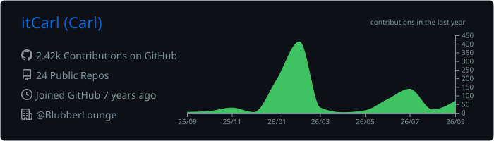
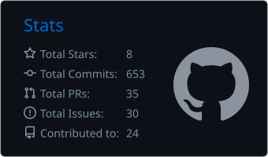
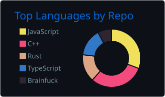
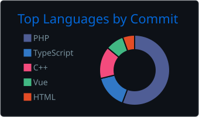
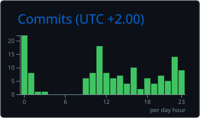

  

 

<!--
  The stats cards below are generated by .github/workflows/profile-summary-cards.yml
  and committed into this repository, so GitHub's own CDN serves them. Nothing here
  renders through a third-party service that can go offline.
  Run that workflow once from the Actions tab before this README goes live.
-->

  <picture>
    <source media="(prefers-color-scheme: dark)" srcset="./profile-summary-card-output/github_dark/0-profile-details.svg" />
    <source media="(prefers-color-scheme: light)" srcset="./profile-summary-card-output/github/0-profile-details.svg" />
    
  </picture>

  <picture>
    <source media="(prefers-color-scheme: dark)" srcset="./profile-summary-card-output/github_dark/3-stats.svg" />
    <source media="(prefers-color-scheme: light)" srcset="./profile-summary-card-output/github/3-stats.svg" />
    
  </picture>
  <picture>
    <source media="(prefers-color-scheme: dark)" srcset="./profile-summary-card-output/github_dark/1-repos-per-language.svg" />
    <source media="(prefers-color-scheme: light)" srcset="./profile-summary-card-output/github/1-repos-per-language.svg" />
    
  </picture>

  <picture>
    <source media="(prefers-color-scheme: dark)" srcset="./profile-summary-card-output/github_dark/2-most-commit-language.svg" />
    <source media="(prefers-color-scheme: light)" srcset="./profile-summary-card-output/github/2-most-commit-language.svg" />
    
  </picture>
  <picture>
    <source media="(prefers-color-scheme: dark)" srcset="./profile-summary-card-output/github_dark/4-productive-time.svg" />
    <source media="(prefers-color-scheme: light)" srcset="./profile-summary-card-output/github/4-productive-time.svg" />
    
  </picture>

 

<!--
  Contribution-graph snake, generated by .github/workflows/snake.yml into the
  "output" branch of this repository. Same idea: no external service involved.
-->

  <picture>
    <source media="(prefers-color-scheme: dark)" srcset="https://raw.githubusercontent.com/itCarl/itCarl/output/github-snake-dark.svg" />
    <source media="(prefers-color-scheme: light)" srcset="https://raw.githubusercontent.com/itCarl/itCarl/output/github-snake.svg" />
    
  </picture>

 

### Currently working on

- TBD

 

 

---

   
    
   <i>A problem can be solved in a 100 different ways and There's always an easier way to solve a problem.</i>
    
   <i>You miss 100% of the shots you don't take.</i>
    
    
   

